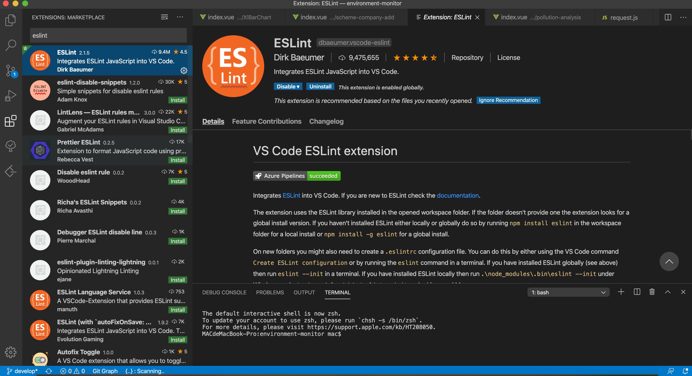

## ESLINT

不管是多人合作还是个人项目，代码规范都是很重要的。这样做不仅可以很大程度地避免基本语法错误，也保证了代码的可读性。项目的基本规范是依托于vue官方的eslint规则[eslint-config-vue](https://github.com/vuejs/eslint-config-vue)

### 代码添加ESLint

简单的代码风格 eslint 可以直接修复，比如我们希望 eslint 修复 src 文件夹下的 js 文件，那么在 package.json 中添加一条自定义命令

```
# 安装eslint模块
npm install eslint --save-dev
```
```
# package.json scripts 中添加修复命令
"lint": "eslint --fix --ext .js,.vue src",
```
执行 npm run lint 将自动修复。无法修复的将在控制台给出提示

### vscode配置ESLint

所谓工欲善其事，必先利其器,使用eslint+vscode来写vue,每次保存，vscode就能标红不符合eslint规则的地方，同时还会做一些简单的自我修正。


首先安装eslint插件


安装并配置完成 ESLint 后，我们继续回到 VSCode 进行扩展设置，依次点击 文件 > 首选项 > 设置 打开 VSCode 配置文件,添加如下配置
```
{
  "files.autoSave": "off",
  "eslint.validate": [
    "javascript",
    "javascriptreact",
    "vue-html",
    {
      "language": "vue",
      "autoFix": true
    }
  ],
  "eslint.run": "onSave",
  "eslint.autoFixOnSave": true
}
```
这样每次保存的时候就可以根据根目录下.eslintrc.js 你配置的 eslint 规则来检查和做一些简单的 fix。
